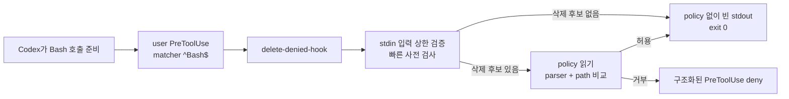

# DELETE-DENIED 작동 원리

이 문서는 v0.2.9 사용자 영역 설치 구조와 현재 구현 경계를 설명한다.

## 훅은 무엇을 하나요?

훅은 Codex가 도구를 사용하기 직전이나 직후에 정해진 검사를 끼워 넣는 공식 기능이다. DELETE-DENIED는 실행 전 단계인 `PreToolUse`에 연결해, Codex의 `Bash` 호출 하나가 실행되기 전에 native(운영체제에서 직접 실행되는) 검사기 `delete-denied-hook`을 한 번 시작한다. `matcher`는 어떤 도구 이름에 이 hook을 붙일지 정하는 필터이며, 여기서는 `^Bash$`다.

결정은 단순하다. 삭제 후보가 없는 명령은 입력을 확인한 뒤 보호 경로 설정(policy)을 열지 않고 통과시킨다. 삭제 후보가 있으면 명령의 대상 경로를 실제 위치와 비교한다. 보호 경로 또는 현재 작업 폴더의 상위 경로 삭제, 안전하게 해석할 수 없는 재귀 삭제, 잘못되거나 크기 제한을 넘은 입력, policy 오류는 모두 형식이 정해진 거부 응답(structured deny)으로 돌려보낸다. 이 hook은 설계상 deny 응답을 반환하지만, 실제 Codex App이 이를 전달받아 실행을 막는지는 live E2E가 확인될 때까지 미검증이다. 프로세스는 그 호출이 끝나면 종료되며, Full Access Permission Profile 자체도 바꾸지 않는다.

## 왜 hook-first인가요?

대표적인 사고 표면이 Codex의 운영체제 shell 호출이므로, 그 호출 직전의 한 지점을 먼저 검사하는 것이 가장 작은 경계다. 이 선택은 “모든 삭제 경로를 감시한다”는 약속이 아니다.

- rules만 사용하면 `$HOME`, 상대 경로, `..`, symlink와 canonical path의 관계를 충분히 판단하기 어렵다. `find -delete`, `rsync --delete`, wrapper와 nested shell도 같은 규칙만으로 일관되게 다루기 어렵다.
- Permission Profile·sandbox를 넓은 주 경계로 삼으면 정상적인 빌드·패키지 설치·외부 경로 작업까지 막을 수 있다. Full Access 사용성을 바꾸지 않고 필요한 shell 경로만 검사하는 편이 범위와 검증 비용이 작다.
- rules를 보조로 복제하면 두 정책의 우선순위와 drift를 함께 관리해야 한다. 현재 구현은 hook을 유일한 실행 전 결정 지점으로 두며, rules가 설치되어야만 안전하다고 가정하지 않는다.

따라서 이 hook 밖의 파일 변경 도구, 브라우저, 파일 관리 앱, 원격 시스템을 가로챈다고 말하지 않는다. 현재 확인 가능한 것은 hook 설정과 검사기의 판단이며, App의 live hook 전달은 미검증이다.

## Bash 한 번의 흐름

`^Bash$`는 command 문자열이 아니라 도구 이름에 적용된다. 따라서 삭제와 무관한 명령도 짧은 hook process 하나를 거치지만, 호출 사이에는 process가 남지 않는다. 이 한 번의 호출이 끝날 때 hook이 만든 파일·로그·상태 변경은 없다.

## 안전한 경로와 의심스러운 경로

1. hook은 stdin을 최대 `256 KiB`까지만 읽고 JSON의 event, tool, `cwd`, command를 확인한다. event는 `PreToolUse`, tool은 `Bash`여야 하며 command는 최대 `64 KiB`다. 이처럼 각 입력에 상한을 두어(bound) 예상 밖으로 커지는 값을 받지 않는다.
2. 빠른 사전 검사(fast scan)가 삭제 후보가 없다고 판단하면 policy/state/manifest를 열지 않고 빈 stdout과 `exit 0`으로 끝난다. 이것이 safe-before-policy 경로다.
3. 후보가 있으면 최대 `16 KiB`의 schema-v1 policy를 읽고 지원된 명령 문법과 경로 문맥을 평가한다. 문자열 경로를 정리하고, 존재하는 가장 가까운 부모를 기준으로 실제 위치를 찾는 과정(canonicalization)을 거친다. 그 뒤 `cwd` 조상과 경로 구성 요소를 비교한다. project descendant는 허용할 수 있지만 filesystem root, users parent, home, Documents, Desktop, Downloads 같은 보호 경로 또는 현재 작업 폴더의 상위 삭제는 거부한다.
4. 허용 결과는 빈 stdout이다. 거부 결과는 `PreToolUse`의 `permissionDecision = "deny"` 응답이며 출력은 최대 `4 KiB`로 제한된다. malformed/oversized 입력과 policy 오류도 같은 structured deny로 끝난다.

검사는 `--policy <absolute-path>`를 받는다. hook은 policy를 직접 생성하거나 수정하지 않으며, 삭제 실제 실행도 하지 않는다. `rm`, `rmdir`, `unlink`, `find -delete`, `xargs rm`, `rsync --delete`, `git clean`과 wrapper·nested shell의 제한된 문맥을 파서가 살핀다.

경로를 해석하는 두 분기는 서로 다르다.

- **대상 확장 실패:** 비재귀 작업에서 대상 변수나 환경 표현을 끝까지 풀지 못하고 인식된 wildcard가 없으면, 그 대상 하나를 건너뛸 수 있다. 이때 실제 파일인지 디렉터리인지 증명하지 않는다. 여러 대상 중 이런 대상은 각자 건너뛰고, 해석된 다른 대상은 계속 검사한다. 재귀 작업이거나 wildcard가 있으면 이 예외를 적용하지 않고 deny한다. 이는 현재 코드의 제한이며, 안전한 경로 확인을 의미하지 않는다.
- **cwd 확장 실패:** `cd` 목적지를 알 수 없을 때는 `rm` 또는 `unlink`이고, 비재귀·모호하지 않으며, 대상이 정확히 하나이고 wildcard와 대상 shell expansion이 없을 때만 해당 작업 전체를 건너뛸 수 있다. 그 밖의 unknown/dynamic cwd 작업은 deny한다.

두 분기 밖에서 보호 경로와 겹치지 않는 것으로 확인된 구체적인 프로젝트 하위 디렉터리 정리는 허용할 수 있지만, 보호 경로 자체·부모·workspace 조상은 계속 거부한다.

## 두 개의 실행 파일

여기서 hot path는 매 `Bash` 호출이 지나는 짧은 경로이고, cold path는 사용자가 직접 실행하는 관리 명령 경로다.

| 실행 파일 | 맡은 일 |
| --- | --- |
| `delete-denied-hook` | user hook의 hot path. 상한을 둔 stdin, fast scan, parser(명령에서 대상 정보를 읽는 코드), policy decision, structured deny를 수행한다. child process·network·log·model·Perl/Python/Node/PowerShell runtime 의존성이 없다. |
| `delete-denied` | 사용자가 명시적으로 실행하는 관리 CLI. install, status, doctor, update, suspend, resume, uninstall, OS 탐지, policy 생성과 사용자 훅 병합을 맡는다. |

두 실행 파일이 공유하는 `delete-denied-core`는 hook 입력/출력 계약, fast scan, 명령 parser, policy와 path decision을 제공한다. CLI를 hook binary에 넣지 않는 이유는 관리 명령의 초기화와 파일 작업이 모든 `Bash` 호출의 hot path에 들어오지 않게 하기 위해서다. CLI는 호출할 때만 잠시 존재하며, 설치 후 대기하는 daemon이 아니다. 설치·업데이트·제거의 사용자 절차는 [`docs/install.md`](install.md)에 있다.

## 사용자 설정의 소유권

설치기는 현재 사용자의 `~/.codex/hooks.json`을 읽고 `PreToolUse` 배열에 DELETE-DENIED 항목만 추가한다. matcher는 `^Bash$`, timeout은 `5`초이고 command는 사용자 `.codex/delete-denied` 아래의 절대 경로다. macOS와 Windows 모두 시스템 폴더를 사용하지 않는다.

기존 훅 파일이 있으면 `backups/hooks.json.before-install`에 한 번 보관한다. 명시적인 Trust 경로가 기존 `config.toml`을 갱신하기 전에는 `backups/config.toml.before-trust`에도 한 번 보관한다. 병합과 제거는 command, timeout, status message가 모두 일치하는 DELETE-DENIED handler만 대상으로 하며 다른 이벤트와 handler는 유지한다. 실행 파일, policy, state, manifest를 먼저 쓴 뒤 훅 설정을 마지막에 기록한다.

manifest에는 훅·CLI·policy 경로와 파일 hash를 기록한다. `status`와 `doctor`는 이 파일들과 현재 훅 등록이 일치하는지, 그리고 Codex `config.toml`의 해당 훅 hash가 Trust되고 비활성화되지 않았는지만 읽는다. 명시적인 `--trust` 설치·업데이트는 app-server의 `hooks/list`로 exact identity를 확인한 뒤 `config/batchWrite`로 해당 key만 갱신하고 다시 검증한다.

## 보호 상태와 lifecycle

`Protected Paths: Enforced`는 로컬 설치와 Codex 활성화가 모두 확인된 상태다. `state.json`의
`protection_enabled=true`, DELETE-DENIED 실행 파일·policy·manifest hash와 사용자 훅 등록이
일치하고, `config.toml`의 해당 handler key에 현재 hash가 Trust되어 `enabled=false`가 아니어야
한다. Trust가 없거나 hash가 바뀌면 `Protected Paths: Awaiting Codex trust`를 표시한다. 일반
`install`은 Trust를 쓰지 않으며, `install --trust`와 `update --trust`만 정확히 일치하는 handler를
app-server를 통해 갱신한다. `status`는 process/network/App을 호출하지 않고 로컬 파일과 config만 읽는다.

`delete-denied suspend`는 현재 사용자 `hooks.json`에서 DELETE-DENIED 항목만 제거하고 `Protected Paths: Suspended`를 기록한다. `resume`은 같은 항목을 다시 병합하며, Codex Trust가 없으면 `Protected Paths: Awaiting Codex trust`를 반환한다. 두 명령은 Full Access나 현재 작업의 권한을 바꾸지 않는다. 자세한 명령은 [`docs/suspend-resume.md`](suspend-resume.md)에 있다.

## 확인된 범위와 남은 한계

엔진에는 POSIX, PowerShell, `cmd`, 제한된 Node/Python inline syntax parser가 구현되어 있다. parser가 특정 문법을 이해한다는 사실만으로 Codex App의 모든 실행 경로를 보호한다고 주장하지 않는다.

또한 hook은 검사 직후 경로가 바뀌는 경쟁(TOCTOU)을 없애는 커널 잠금이 아니다. hook 밖에서 별도 작업을 하거나 Codex가 hook 밖의 도구를 호출하면 이 경계는 적용되지 않는다. 이런 경우를 포함한 보호·우회 범위는 별도의 위협 모델에서 설명한다.

DELETE-DENIED는 OS 전체 삭제 차단기가 아니다. 보호 범위와 우회·실패 조건은 [보호 범위와 한계](threat-model.md), 공개 근거와 미확인 항목은 [조사 근거](research.md)에서 확인한다.
